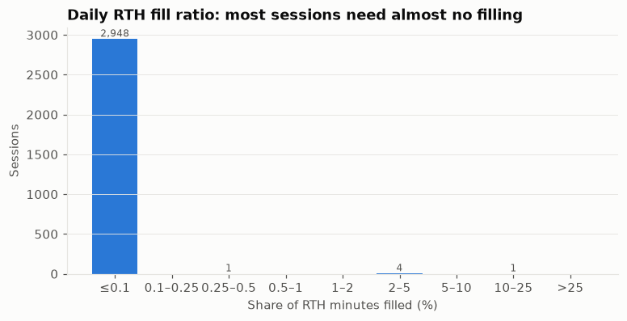
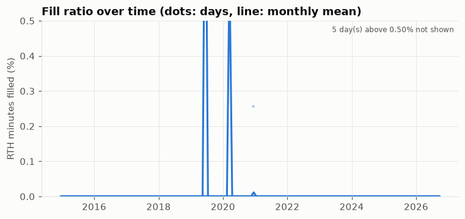
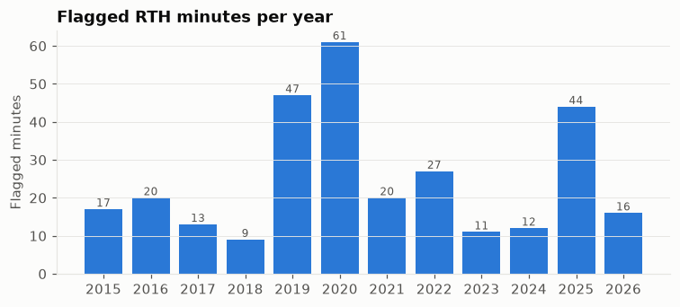
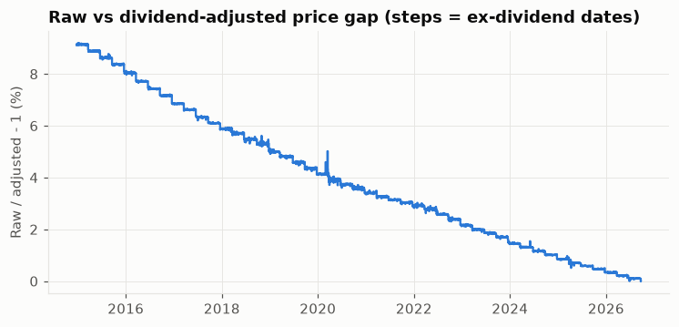
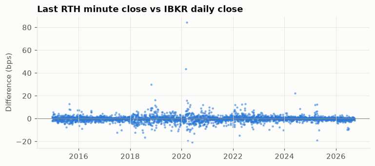

# Week 1 資料品質報告

產生時間：2026-09-23 11:47 ET　·　資料建置：2026-09-23T11:23

資料來源：IBKR TWS API（`scripts/download_ibkr.py`）。清理程式：`src/data_loader.py`。
人工檢視結論見 [`week01_review_notes.md`](week01_review_notes.md)。

## 1. 總覽

| 項目 | 數值 |
|---|---|
| 分鐘資料範圍 (ET) | 2014-12-22 04:11 → 2026-09-22 19:59 |
| 交易日（有 RTH 分鐘資料） | 2,954（2014-12-22 → 2026-09-22） |
| 其中半日交易日 | 24 |
| RTH 1 分鐘 bar | 1,147,740 |
| 盤前盤後 1 分鐘 bar | 1,656,873 |
| 原始檔 / 原始列數 | 613 檔 / 4,651,680 列 |
| 週檔重疊去重 | 1,846,662 列（值不一致的衝突：0） |
| 丟棄的未完成交易日 | 2026-09-23 |
| 與 IBKR 日線比對缺少的交易日 | 無 |
| 不在 IBKR 日線中的交易日 | 無 |

每年交易日數：2014: 7, 2015: 252, 2016: 252, 2017: 251, 2018: 251, 2019: 252, 2020: 253, 2021: 252, 2022: 251, 2023: 250, 2024: 252, 2025: 250, 2026: 181

## 2. 缺失分鐘與補值

規則：RTH 每個應有的分鐘都必須存在（一般日 390 根、半日 210 根）。
缺的分鐘以**該分鐘之前**最後一筆成交價補上（OHLC 皆為此價，成交量 0），絕不往回補。
IBKR 自己送來的零成交 bar（volume=0、barCount=0）也計入補值。

| 指標 | 數值 |
|---|---|
| 補值分鐘合計 | 145（0.013%） |
| 　其中 IBKR 缺漏、由我們補上 | 0 |
| 　其中 IBKR 零成交 bar | 145 |
| 每日補值比例 中位數 / P90 / P95 / P99 | 0.00% / 0.00% / 0.00% / 0.00% |
| 每日補值比例 最大 | 22.56% |
| 補值比例 > 5% 的交易日 | 1 |

補值比例最高的 10 天：

| date | fill_ratio | missing_ratio | n_minutes | is_half_day |
|---|---|---|---|---|
| 2019-06-17 | 22.56% | 0.0% | 390 | False |
| 2020-03-09 | 3.59% | 0.0% | 390 | False |
| 2020-03-12 | 3.59% | 0.0% | 390 | False |
| 2020-03-16 | 3.59% | 0.0% | 390 | False |
| 2020-03-18 | 3.59% | 0.0% | 390 | False |
| 2020-12-07 | 0.26% | 0.0% | 390 | False |
| 2014-12-22 | 0.0% | 0.0% | 390 | False |
| 2014-12-23 | 0.0% | 0.0% | 390 | False |
| 2014-12-24 | 0.0% | 0.0% | 210 | True |
| 2014-12-26 | 0.0% | 0.0% | 390 | False |

## 3. 異常值（只標記，不刪除）

門檻（`CleanConfig`）：單分鐘 |log 報酬| > 1%；
或 > 8 倍「前 390 根」報酬標準差（只用過去資料）；
或 bar 高低價差 > 1%；或 OHLC 不合理。

被標記的分鐘：**297**。完整清單：[`week01_anomalies.csv`](week01_anomalies.csv)（請人工檢視）。

依類型（一分鐘可有多種）：`sigma_return` 224, `bar_range` 91, `abs_return` 29

|報酬|最大的 15 筆：

| time (ET) | flags | 1-min return | close | volume |
|---|---|---|---|---|
| 2015-08-24 09:32 | abs_return;sigma_return;bar_range | 3.228% | 92.25 | 1514564 |
| 2025-04-09 13:19 | abs_return;sigma_return;bar_range | 2.714% | 434.33 | 1838599 |
| 2020-03-03 10:00 | abs_return;sigma_return;bar_range | 2.171% | 218.83 | 1836074 |
| 2015-08-24 09:35 | abs_return;sigma_return;bar_range | 2.012% | 94.9 | 768502 |
| 2025-04-07 10:18 | abs_return;bar_range | -1.752% | 434.52 | 1037550 |
| 2025-04-07 10:10 | abs_return;sigma_return;bar_range | 1.699% | 423.73 | 1148163 |
| 2025-04-07 11:14 | abs_return;bar_range | -1.685% | 417.27 | 1329158 |
| 2020-03-18 15:59 | abs_return;bar_range | 1.669% | 176.42 | 1790260 |
| 2015-08-24 09:36 | abs_return;bar_range | 1.579% | 96.41 | 1271787 |
| 2025-04-09 13:28 | abs_return;bar_range | -1.576% | 444.96 | 1171842 |
| 2022-11-02 14:36 | abs_return;sigma_return;bar_range | -1.548% | 273.7 | 1135424 |
| 2025-04-07 10:13 | abs_return;bar_range | 1.381% | 436.63 | 1341547 |
| 2020-03-16 15:44 | abs_return;bar_range | 1.292% | 177.67 | 496849 |
| 2022-09-21 14:00 | abs_return;sigma_return;bar_range | -1.275% | 287.61 | 1190874 |
| 2020-03-26 15:50 | abs_return;sigma_return;bar_range | 1.228% | 190.97 | 1702560 |

## 4. 半日交易日

依交易所規則（感恩節隔日；7/3 與 12/24 落在週一至週四時）判定，並與資料交叉驗證：
半日交易日的盤後資料都在 16:59 結束。範圍內共 24 天，
沒有資料的：無。

2014-12-24, 2015-11-27, 2015-12-24, 2016-11-25, 2017-07-03, 2017-11-24, 2018-07-03, 2018-11-23, 2018-12-24, 2019-07-03, 2019-11-29, 2019-12-24, 2020-11-27, 2020-12-24, 2021-11-26, 2022-11-25, 2023-07-03, 2023-11-24, 2024-07-03, 2024-11-29, 2024-12-24, 2025-07-03, 2025-11-28, 2025-12-24

`load_daily(exclude_half_days=True)` 等函式可直接排除半日交易日。

## 5. 盤後提早結束的交易日

一般日盤後應到 19:59、半日到 16:59。以下日子最後一根盤外 bar 較早：

| date | last bar (ET) |
|---|---|
| 2015-06-30 | 19:29 |

## 6. 拆股與股息

* IBKR 的 TRADES 日線已做拆股調整（1999 年價格約 51，而實際掛牌價約 100，2000 年 1 拆 2）。2015 年後 QQQ 無拆股。
* 分鐘資料與 IBKR 日線收盤比對：|差異| 中位數 1.0 bps、最大 84.2 bps；
  超過 2%（疑似未調整拆股）的交易日：無。
* 分鐘資料**未做股息調整**。股息由兩份日線的調整因子反推，範圍內共 48 次除息。
  跨日報酬（`ret_overnight`、`ret_cc`）已加回股息；日內報酬不受影響。
* 資料有缺口的前一交易日（`prev_day_missing`）不計算跨日報酬。

| ex-date | dividend (USD) |
|---|---|
| 2015-03-20 | 0.248 |
| 2015-06-19 | 0.2542 |
| 2015-09-18 | 0.26 |
| 2015-12-18 | 0.3423 |
| 2016-03-18 | 0.3178 |
| 2016-06-17 | 0.2867 |
| 2016-09-16 | 0.2938 |
| 2016-12-16 | 0.3549 |
| 2017-03-17 | 0.2743 |
| 2017-06-16 | 0.3784 |
| 2017-09-18 | 0.3193 |
| 2017-12-18 | 0.3294 |
| 2018-03-19 | 0.2766 |
| 2018-06-18 | 0.3783 |
| 2018-09-24 | 0.3297 |
| 2018-12-24 | 0.4205 |
| 2019-03-18 | 0.3243 |
| 2019-06-24 | 0.4155 |
| 2019-09-23 | 0.3842 |
| 2019-12-23 | 0.4577 |
| 2020-03-23 | 0.3627 |
| 2020-06-22 | 0.4242 |
| 2020-09-21 | 0.3882 |
| 2020-12-21 | 0.5614 |
| 2021-03-22 | 0.3947 |
| 2021-06-21 | 0.3968 |
| 2021-09-20 | 0.4139 |
| 2021-12-20 | 0.4914 |
| 2022-03-21 | 0.4337 |
| 2022-06-21 | 0.5274 |
| 2022-09-19 | 0.5186 |
| 2022-12-19 | 0.6554 |
| 2023-03-20 | 0.4722 |
| 2023-06-20 | 0.5039 |
| 2023-09-18 | 0.5356 |
| 2023-12-18 | 0.8083 |
| 2023-12-27 | 0.2158 |
| 2024-03-18 | 0.5735 |
| 2024-06-24 | 0.7614 |
| 2024-09-23 | 0.6769 |
| 2024-12-23 | 0.8347 |
| 2025-03-24 | 0.7157 |
| 2025-06-23 | 0.591 |
| 2025-09-22 | 0.694 |
| 2025-12-22 | 0.794 |
| 2026-03-23 | 0.7328 |
| 2026-06-22 | 0.8135 |
| 2026-09-21 | 0.7514 |

## 7. 未來資訊洩漏的防護

* 每根 bar 有 `bar_end`：1 分鐘 bar 在開始時間 +1 分鐘後才可用，5 分鐘 bar 在 +5 分鐘後。
* 補值只用該分鐘之前的價格；異常值的 σ 只用過去的報酬。
* `ADJUSTED_LAST` 是回溯調整，價格水準含有未來股息資訊：**只用它的報酬，不用它的價格水準**。
* 股息在除息日使用（當時已公告）；半日交易日由事先公布的規則判定。
* 下載當下尚未收盤的交易日已丟棄。

## 8. 產出檔案（`data/processed/`）

| 檔案 | 內容 |
|---|---|
| `minute_all_sessions.parquet` | 去重後的全部分鐘資料 + session 標籤 |
| `minute_rth.parquet` | RTH 1 分鐘完整網格，含 `is_filled`、`fill_source`、`bar_end` |
| `minute_ext.parquet` | 盤前、盤後（不補值） |
| `bars_5min.parquet` | 5 分鐘 RTH bar |
| `daily.parquet` | 由分鐘資料聚合的日線 + 品質指標 + 股息 + 報酬 |
| `daily_ibkr.parquet` | IBKR 日線（原始 + 調整）與推得的股息 |
| `anomalies.parquet` | 異常值清單 |
| `build_meta.json` | 本報告用到的統計與參數 |
