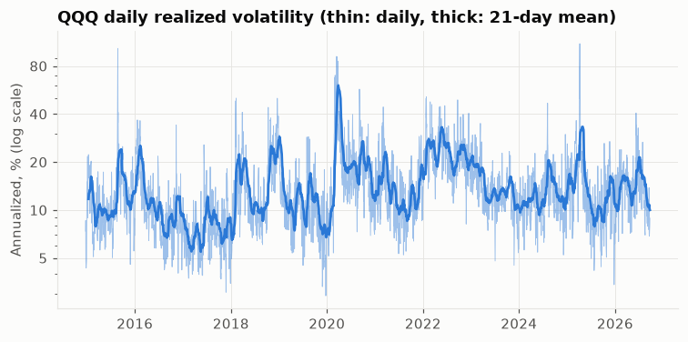
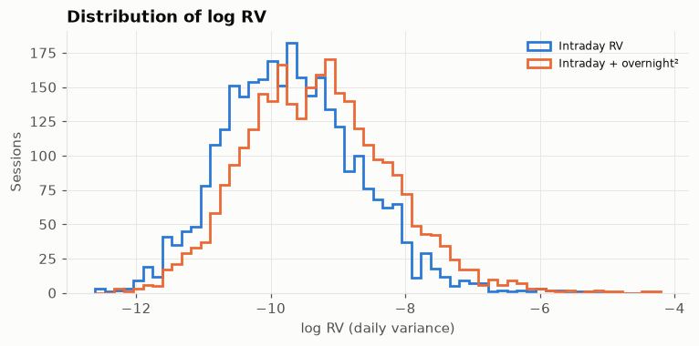
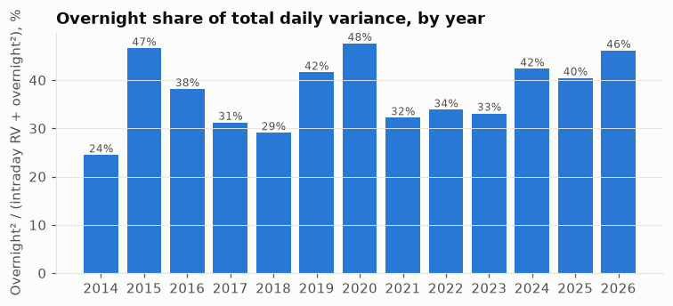

# Week 2 特徵工程報告

產生時間：2026-09-23 12:26 ET　·　特徵建置：2026-09-23T12:24

程式：`src/features.py`（特徵、RV）、`src/validation.py`（walk-forward）。
矩陣：`data/processed/features_prev_close.parquet`、`features_open.parquet`；
目標（本週不建模，只用於洩漏檢查）：`targets_daily.parquet`。

## 1. 資訊截止點

| cutoff | 可用資訊 |
|---|---|
| `calendar` | exchange calendar only (known in advance) |
| `prev_close` | t-1 close (16:15 ET incl. Cboe close; 13:15 on half days) |
| `open` | t open print, 09:30 ET (first 5-min bar's open only) |
| `open_5m` | t first 5-min bar, 09:35 ET |

預測日 t 的矩陣只包含 cutoff ≤ 決策時點的特徵；`features_prev_close` 不含 `overnight_gap`，
`features_open` 才有。

## 2. 特徵清單

設定：`{'rv_include_overnight': False, 'volume_window': 20, 'min_periods_frac': 0.8, 'max_fill_ratio': 0.05, 'vix_max_stale_days': 5}`

| name | cutoff | definition | non_null | mean | std |
|---|---|---|---|---|---|
| har_rv_1d | prev_close | RV of session t-1 | 2952 | 0.0001119 | 0.0002291 |
| har_logrv_1d | prev_close | log of har_rv_1d | 2952 | -9.692 | 1.005 |
| har_rv_5d | prev_close | mean RV over sessions t-5..t-1 | 2950 | 0.000112 | 0.0001869 |
| har_logrv_5d | prev_close | log of har_rv_5d | 2950 | -9.578 | 0.8936 |
| har_rv_22d | prev_close | mean RV over sessions t-22..t-1 | 2936 | 0.0001123 | 0.0001438 |
| har_logrv_22d | prev_close | log of har_rv_22d | 2936 | -9.475 | 0.8097 |
| rskew_1d | prev_close | realized skewness of t-1 5-min returns: sqrt(N)·Σr³/RV^1.5 | 2952 | -0.02082 | 0.8667 |
| rkurt_1d | prev_close | realized kurtosis of t-1 5-min returns: N·Σr⁴/RV² | 2952 | 4.846 | 2.626 |
| volume_rel_20d | prev_close | RTH volume of t-1 / mean RTH volume of t-20..t-1 | 2937 | 1.01 | 0.3754 |
| close_loc_1d | prev_close | (C-L)/(H-L) of session t-1 (0.5 if H==L) | 2952 | 0.5629 | 0.3131 |
| overnight_gap | open | log((open_t + dividend_t) / close_{t-1}); known only at t's 09:30 open | 2952 | 0.0004601 | 0.008602 |
| day_of_week | calendar | weekday of t (0=Mon .. 4=Fri) | 2954 | 2.02 | 1.399 |
| is_half_day | calendar | 1 if t is a 13:00 early close | 2954 | 0.008125 | 0.08978 |
| prev_is_half_day | calendar | 1 if t-1 was an early close (its RV covers fewer bars) | 2953 | 0.008127 | 0.0898 |
| vix_1d | prev_close | VIX close of the last Cboe date before t | 2954 | 18.33 | 6.953 |
| vxn_1d | prev_close | VXN close of the last Cboe date before t | 2954 | 22.16 | 7.133 |

VIX / VXN：對齊到前一個 Cboe 交易日；落後天數分布：{1: 2340, 2: 21, 3: 534, 4: 59}；超過 5 天設為 NaN。

## 3. 已實現波動（RV）

* `rv`：當日 5 分鐘 log 報酬平方和（開盤到收盤，只算日內）。
* `rv_on`：`rv` + 隔夜報酬²（前一交易日收盤 → 當日開盤，已加回股息；前一交易日缺資料時為 NaN）。
* HAR 特徵預設用 `rv`；`python -m src.features --rv-overnight` 切換成 `rv_on`。
* 年化 RV（√(252·rv)）：中位數 12.2%，P5 5.7%，P95 28.7%，最大 110%（2025-04-07）。
* 有效交易日（完整且補值比例 ≤ 5%）：2953 / 2954；
  無效日：2019-06-17。

## 4. Walk-forward 切分

預設：訓練 3 年、測試 1 年、每次前移 1 年（滾動）。樣本 = 所有 prev_close 特徵齊全且目標有效的交易日
（2934 天，2015-01-20 → 2026-09-22）。
第一個測試年取「第一筆樣本 + 3 年」之後的第一個 1 月 1 日，確保每折訓練都滿 3 年。

| fold | train_start | train_end | n_train | test_start | test_end | n_test |
|---|---|---|---|---|---|---|
| 1 | 2016-01-04 | 2018-12-31 | 754 | 2019-01-02 | 2019-12-31 | 250 |
| 2 | 2017-01-03 | 2019-12-31 | 752 | 2020-01-02 | 2020-12-31 | 253 |
| 3 | 2018-01-02 | 2020-12-31 | 754 | 2021-01-04 | 2021-12-31 | 252 |
| 4 | 2019-01-02 | 2021-12-31 | 755 | 2022-01-03 | 2022-12-30 | 251 |
| 5 | 2020-01-02 | 2022-12-30 | 756 | 2023-01-03 | 2023-12-29 | 250 |
| 6 | 2021-01-04 | 2023-12-29 | 753 | 2024-01-02 | 2024-12-31 | 252 |
| 7 | 2022-01-03 | 2024-12-31 | 753 | 2025-01-02 | 2025-12-31 | 250 |
| 8 | 2023-01-03 | 2025-12-31 | 752 | 2026-01-02 | 2026-09-22 | 181 |

## 5. 測試結果

31 / 31 通過。

| file | test | result | seconds |
|---|---|---|---|
| test_features | test_truncation_features_unchanged[calendar] | passed | 8.4 |
| test_features | test_truncation_features_unchanged[prev_close] | passed | 23.4 |
| test_features | test_truncation_features_unchanged[open] | passed | 23.1 |
| test_features | test_truncation_features_unchanged[open_5m] | passed | 23.1 |
| test_features | test_truncation_catches_a_leaky_feature | passed | 0.0 |
| test_features | test_later_cutoff_features_excluded | passed | 0.2 |
| test_features | test_extras_respect_cutoff | passed | 2.6 |
| test_features | test_label_time_after_every_feature_cutoff | passed | 1.6 |
| test_features | test_realized_variance_definition | passed | 1.3 |
| test_features | test_realized_variance_with_overnight | passed | 2.7 |
| test_features | test_overnight_adds_dividend | passed | 0.0 |
| test_features | test_invalid_session_is_nan | passed | 0.0 |
| test_features | test_har_windows | passed | 1.4 |
| test_features | test_volume_close_loc_dow | passed | 0.0 |
| test_features | test_realized_moments_reasonable | passed | 0.0 |
| test_features | test_vix_alignment | passed | 0.0 |
| test_features | test_read_cboe_csv | passed | 0.1 |
| test_features | test_from_processed_pipeline | passed | 2.4 |
| test_validation | test_default_folds | passed | 0.0 |
| test_validation | test_no_overlap_and_time_order[kw0] | passed | 0.0 |
| test_validation | test_no_overlap_and_time_order[kw1] | passed | 0.0 |
| test_validation | test_no_overlap_and_time_order[kw2] | passed | 0.0 |
| test_validation | test_no_overlap_and_time_order[kw3] | passed | 0.0 |
| test_validation | test_no_overlap_and_time_order[kw4] | passed | 0.0 |
| test_validation | test_rolling_window_length | passed | 0.0 |
| test_validation | test_expanding_anchored | passed | 0.0 |
| test_validation | test_embargo_gap | passed | 0.0 |
| test_validation | test_partial_last_fold_and_min_test | passed | 0.0 |
| test_validation | test_unsorted_dates_rejected | passed | 0.0 |
| test_validation | test_preprocessing_fitted_on_train_only | passed | 0.1 |
| test_validation | test_sklearn_cv_compatible | passed | 0.0 |

* **截斷測試**（`test_truncation_features_unchanged`）：對 4 種 cutoff，各在約 18 個日期
  （隨機 + 缺資料日隔天、無效日隔天、Cboe 獨有日期、VIX 缺口、除息日、半日交易日）刪除截止點之後的所有資料重算，
  當天每個特徵都必須不變。
* **反向對照**（`test_truncation_catches_a_leaky_feature`）：故意註冊一個用當日收盤的洩漏特徵，確認截斷測試抓得到。
* **標籤時間**：每個特徵的截止時間都早於標籤時間（當日收盤）。
* **切分器**：訓練與測試不重疊、訓練全部早於測試、每天最多被測一次、embargo、sklearn `cv=` 相容；
  補值與標準化的參數只由各折訓練段估計。
* 依要求**未**用「特徵與目標相關係數」判斷洩漏。
