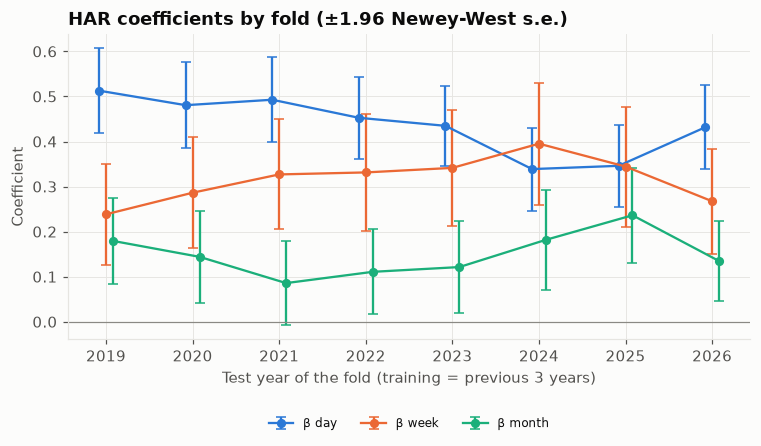
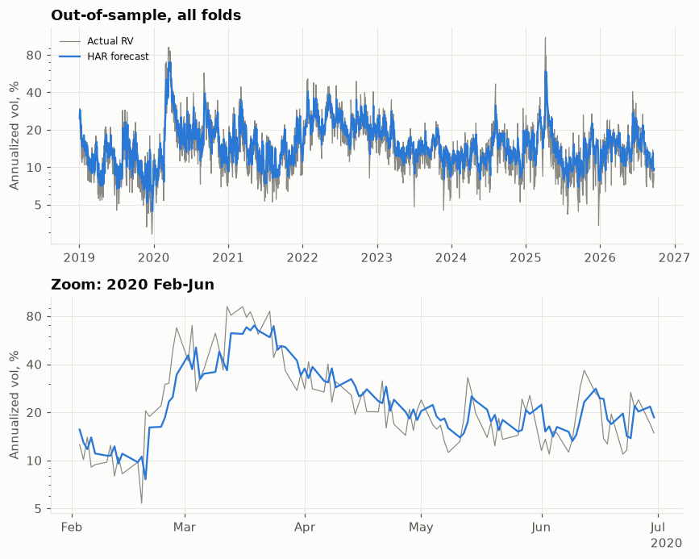
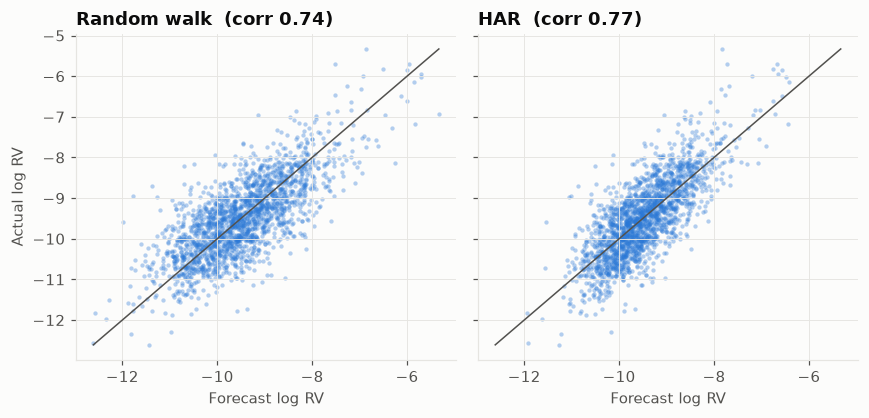
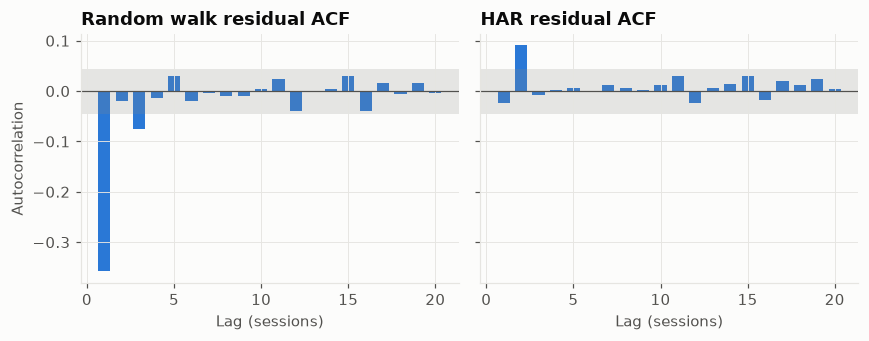

# Week 3 HAR 基準模型

產生時間：2026-09-23 12:43 ET　·　預測存檔：2026-09-23T12:43

程式：`src/models/har.py`、`src/models/base.py`、`src/metrics.py`。
預測：`data/processed/predictions/har_baselines.parquet`（7,748 列）、
係數：`har_baselines_coefficients.parquet`。
檢視結論見 [`week03_review_notes.md`](week03_review_notes.md)。

## 完成標準

主結果（日內 RV）：HAR 勝過 random walk —
RMSE ✅、MAE ✅、QLIKE ✅
（含隔夜版：RMSE ✅、MAE ✅、QLIKE ✅）。

## 1. 設定

* **列 t = 預測日**。特徵來自 `features_prev_close`（t−1 收盤前可知），標籤為 t 日的 log RV（t 收盤後才知道）；
  等同「用 t 以前資訊預測 log RV(t+1)」。建立資料集時逐列檢查標籤時間 > 特徵截止時間。
* 目標：`rv`（日內，主結果）與 `rv_on`（日內 + 隔夜²）。含隔夜版的 HAR 自變數也改用 rv_on 計算。
* **Random walk**：log RV̂(t) = log RV(t−1)；變異數預測就是 RV(t−1)，不做偏誤修正。
* **HAR**：log RV(t) = b0 + β_d·log RV(t−1) + β_w·log(平均 RV t−5..t−1) + β_m·log(平均 RV t−22..t−1)，OLS；
  標準誤為 Newey-West（5 期）。變異數預測 = exp(預測 + σ²/2)，σ² = 該折訓練段殘差變異數。
* Walk-forward：{'train_years': 3, 'test_years': 1, 'step_years': 1, 'first_test_start': None, 'expanding': False, 'embargo_days': 0, 'min_test_days': 20}。兩個模型使用完全相同的樣本日期。
* 誤差：RMSE、MAE 在對數尺度；QLIKE 在變異數尺度。

## 2. 誤差比較（全部樣本外）

| target | model | n | rmse_log | mae_log | qlike |
|---|---|---|---|---|---|
| rv | har | 1939 | 0.6093 | 0.4771 | 0.1974 |
| rv | har_nocorr | 1939 | 0.6093 | 0.4771 | 0.2192 |
| rv | rw | 1939 | 0.6841 | 0.5378 | 0.2762 |
| rv_on | har | 1935 | 0.7195 | 0.5609 | 0.2849 |
| rv_on | har_nocorr | 1935 | 0.7195 | 0.5609 | 0.328 |
| rv_on | rw | 1935 | 0.8376 | 0.6551 | 0.4443 |

HAR / RW 比值（< 1 代表 HAR 較好）：

| target | rmse_log | mae_log | qlike |
|---|---|---|---|
| rv | 0.891 | 0.887 | 0.715 |
| rv_on | 0.859 | 0.856 | 0.641 |

Diebold-Mariano 檢定（負值 = HAR 損失較小）：

| target | loss | DM (HAR−RW) | p-value |
|---|---|---|---|
| rv | squared log error | -10.79 | 3.9e-27 |
| rv | QLIKE | -8.83 | 1e-18 |
| rv_on | squared log error | -11.08 | 1.5e-28 |
| rv_on | QLIKE | -7.14 | 9.2e-13 |

`har_nocorr` 是同一組 HAR 預測但不做 exp(σ²/2) 修正，用來看偏誤修正對 QLIKE 的影響。

## 3. 逐年誤差（日內 RV）

| year | n | RMSE RW | RMSE HAR | RMSE ratio | QLIKE RW | QLIKE HAR | QLIKE ratio |
|---|---|---|---|---|---|---|---|
| 2019 | 250 | 0.716 | 0.634 | 0.886 | 0.308 | 0.22 | 0.716 |
| 2020 | 253 | 0.719 | 0.66 | 0.918 | 0.316 | 0.238 | 0.753 |
| 2021 | 252 | 0.729 | 0.643 | 0.882 | 0.311 | 0.216 | 0.696 |
| 2022 | 251 | 0.607 | 0.541 | 0.891 | 0.216 | 0.153 | 0.709 |
| 2023 | 250 | 0.609 | 0.508 | 0.833 | 0.204 | 0.131 | 0.645 |
| 2024 | 252 | 0.626 | 0.561 | 0.897 | 0.234 | 0.169 | 0.722 |
| 2025 | 250 | 0.775 | 0.715 | 0.924 | 0.37 | 0.277 | 0.748 |
| 2026 | 181 | 0.667 | 0.572 | 0.859 | 0.241 | 0.166 | 0.685 |
| all | 1939 | 0.684 | 0.609 | 0.891 | 0.276 | 0.197 | 0.715 |

## 4. 各折係數

日內 RV（括號內為 Newey-West 標準誤）：

| fold | train | b0 | β_d | β_w | β_m | β_d+β_w+β_m | R² train | σ² resid |
|---|---|---|---|---|---|---|---|---|
| 1 | 2016-01 → 2018-12 | -0.758 (0.282) | 0.513 (0.048) | 0.238 (0.057) | 0.179 (0.049) | 0.931 | 0.677 | 0.343 |
| 2 | 2017-01 → 2019-12 | -0.970 (0.283) | 0.481 (0.049) | 0.286 (0.063) | 0.144 (0.052) | 0.911 | 0.647 | 0.365 |
| 3 | 2018-01 → 2020-12 | -0.959 (0.246) | 0.493 (0.048) | 0.327 (0.062) | 0.086 (0.048) | 0.905 | 0.679 | 0.392 |
| 4 | 2019-01 → 2021-12 | -1.085 (0.294) | 0.453 (0.047) | 0.331 (0.066) | 0.111 (0.048) | 0.895 | 0.626 | 0.416 |
| 5 | 2020-01 → 2022-12 | -0.987 (0.250) | 0.435 (0.045) | 0.341 (0.066) | 0.121 (0.052) | 0.898 | 0.626 | 0.374 |
| 6 | 2021-01 → 2023-12 | -0.850 (0.260) | 0.339 (0.047) | 0.395 (0.069) | 0.182 (0.057) | 0.916 | 0.586 | 0.315 |
| 7 | 2022-01 → 2024-12 | -0.745 (0.246) | 0.346 (0.046) | 0.344 (0.068) | 0.236 (0.054) | 0.927 | 0.608 | 0.28 |
| 8 | 2023-01 → 2025-12 | -1.673 (0.446) | 0.432 (0.048) | 0.267 (0.059) | 0.135 (0.045) | 0.834 | 0.463 | 0.352 |

三個 β 共 24 個估計值：24 個為正，23 個 t > 1.96。

含隔夜 RV：

| fold | train | b0 | β_d | β_w | β_m | β_d+β_w+β_m | R² train | σ² resid |
|---|---|---|---|---|---|---|---|---|
| 1 | 2016-01 → 2018-12 | -0.890 (0.307) | 0.319 (0.055) | 0.381 (0.076) | 0.219 (0.060) | 0.919 | 0.598 | 0.464 |
| 2 | 2017-01 → 2019-12 | -0.969 (0.305) | 0.290 (0.049) | 0.423 (0.068) | 0.199 (0.062) | 0.912 | 0.576 | 0.466 |
| 3 | 2018-01 → 2020-12 | -1.078 (0.264) | 0.359 (0.047) | 0.424 (0.066) | 0.108 (0.050) | 0.892 | 0.621 | 0.499 |
| 4 | 2019-01 → 2021-12 | -1.162 (0.296) | 0.380 (0.045) | 0.382 (0.067) | 0.122 (0.047) | 0.884 | 0.589 | 0.514 |
| 5 | 2020-01 → 2022-12 | -1.109 (0.266) | 0.411 (0.046) | 0.321 (0.066) | 0.150 (0.052) | 0.882 | 0.583 | 0.48 |
| 6 | 2021-01 → 2023-12 | -0.940 (0.293) | 0.334 (0.047) | 0.311 (0.066) | 0.261 (0.068) | 0.906 | 0.52 | 0.415 |
| 7 | 2022-01 → 2024-12 | -1.040 (0.310) | 0.293 (0.042) | 0.271 (0.070) | 0.332 (0.073) | 0.896 | 0.479 | 0.429 |
| 8 | 2023-01 → 2025-12 | -2.018 (0.505) | 0.315 (0.048) | 0.293 (0.067) | 0.186 (0.056) | 0.794 | 0.352 | 0.522 |

## 5. 診斷圖

殘差自相關（日內 RV，對數尺度）：lag-1 ACF — RW -0.358、HAR -0.024；
Ljung-Box Q(10) — RW 263.5（p=7.8e-51）、HAR 18.0（p=0.055）。
