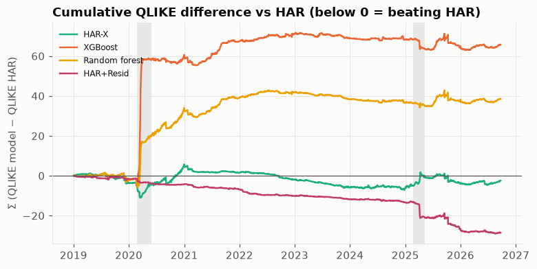
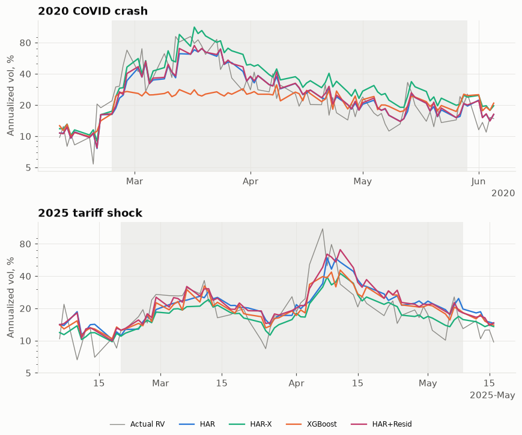
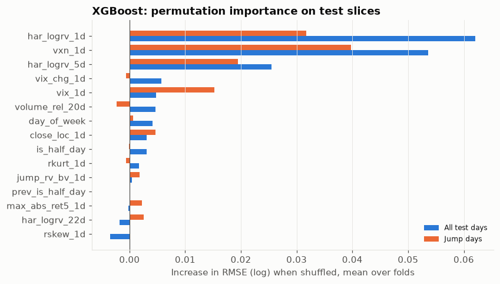
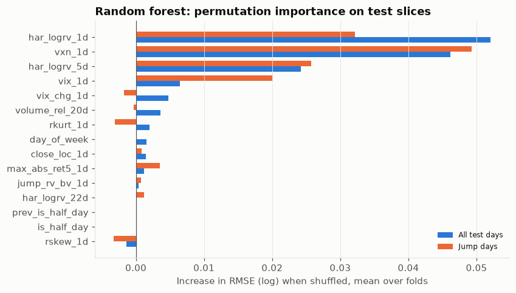
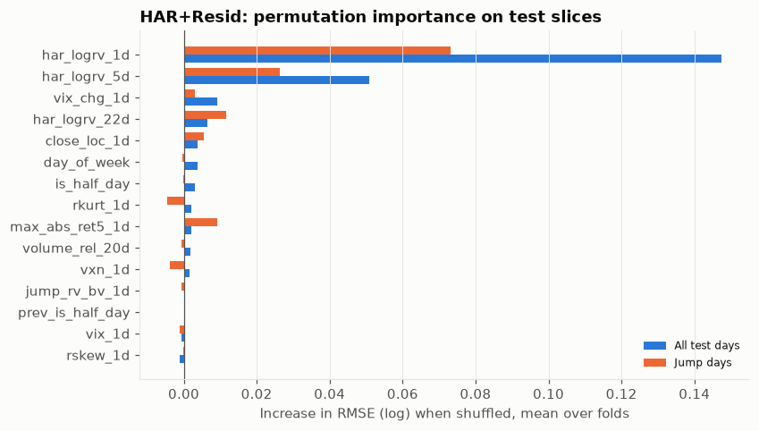

# Week 4 XGBoost 波動模型

產生時間：2026-09-23 19:47 ET　·　預測存檔：2026-09-23T19:46

程式：`src/models/trees.py`（XGBoost、隨機森林、調參、permutation importance）、
`src/models/har.py`（HAR-X）、`src/models/residual.py`（HAR+殘差修正）、
`src/models/week4.py`（執行）。
預測：`data/processed/predictions/week4_models.parquet`；HAR、RW 讀自 `har_baselines.parquet`（未重新訓練）。
切片定義：`config/evaluation.toml`（在看模型結果前確認）；定義與基準核對見 `week04_definitions.md`。

## 結論：模型對 HAR（QLIKE，全部樣本外）

* XGBoost：較差但不顯著（QLIKE 比值 1.172，DM p = 0.2）
* 隨機森林：較差但不顯著（QLIKE 比值 1.101，DM p = 0.082）
* HAR-X：較好但**不顯著**（QLIKE 比值 0.994，DM p = 0.83）
* **HAR+殘差XGB**：**顯著較好**（QLIKE 比值 0.925，DM p = 0.00045）

分期間與切片的結果見第 3、4 節；解讀見 `week04_review_notes.md`。

## 1. 設定

* 目標：t 日的 log RV（日內，主結果），特徵來自 `features_prev_close`（t−1 收盤前可知）。
* **HAR-X**：HAR 三項 + log VIX + log VXN，OLS。
* **XGBoost / 隨機森林**：15 個特徵：`har_logrv_1d, har_logrv_5d, har_logrv_22d, rskew_1d, rkurt_1d, volume_rel_20d, close_loc_1d, day_of_week, is_half_day, prev_is_half_day, vix_1d, vxn_1d, max_abs_ret5_1d, jump_rv_bv_1d, vix_chg_1d`。
* **HAR+殘差XGB**（`har_resid_xgb`）：先用整個訓練段重新配一次 HAR，再讓 XGBoost 去預測
  HAR 的殘差（`y − HAR.predict(X)`），XGBoost 的調參、early stopping 都跟一般 XGBoost 一樣，
  只是目標換成殘差。最終預測 = HAR 預測 + XGBoost 對殘差的預測。動機：樹模型無法外插訓練範圍外
  的極端值，讓 HAR 負責外插、樹只做局部修正，理論上能同時保住 HAR 在極端事件的表現、又保留樹
  模型在其他時期抓到的非線性訊號。
* 調參只在每折訓練段內：訓練段最後一年當驗證段；XGBoost 用 early stopping 決定樹數，
  網格 max_depth × learning_rate；隨機森林網格 max_depth × min_samples_leaf × max_features。
  選定後以整個訓練段重新訓練。測試段不參與。
* 變異數預測 = exp(預測 + σ²/2)。HAR / HAR-X 的 σ² = 訓練段殘差變異數；樹模型的訓練段內殘差會嚴重低估，
  改用**驗證段**的殘差均方（仍在訓練段內）。HAR+殘差XGB 的 σ² 用同一套邏輯，但驗證段殘差已經是
  「HAR 殘差再被樹修正後」的誤差，等於是整個組合模型的驗證段殘差。
* 比較樣本：所有模型都有預測的日期（1939 天；因特徵缺值少了 0 天）。

## 2. 全部樣本外

| model | n | rmse_log | mae_log | qlike | rmse_log / HAR | mae_log / HAR | qlike / HAR |
|---|---|---|---|---|---|---|---|
| Random walk | 1939 | 0.6841 | 0.5378 | 0.2762 | 1.123 | 1.127 | 1.399 |
| HAR | 1939 | 0.6093 | 0.4771 | 0.1974 | 1.0 | 1.0 | 1.0 |
| HAR-X | 1939 | 0.6236 | 0.4949 | 0.1962 | 1.023 | 1.037 | 0.994 |
| XGBoost | 1939 | 0.6496 | 0.5133 | 0.2313 | 1.066 | 1.076 | 1.172 |
| HAR+Resid | 1939 | 0.5938 | 0.4647 | 0.1827 | 0.975 | 0.974 | 0.925 |
| Random forest | 1939 | 0.6464 | 0.5107 | 0.2173 | 1.061 | 1.07 | 1.101 |

Diebold-Mariano（各模型對 HAR，QLIKE；負值 = 優於 HAR）：

| model | n | mean diff (model−HAR) | DM | p-value |
|---|---|---|---|---|
| Random walk | 1939 | +0.0788 | 8.83 | 1e-18 |
| HAR-X | 1939 | -0.0013 | -0.22 | 0.83 |
| XGBoost | 1939 | +0.0339 | 1.28 | 0.2 |
| Random forest | 1939 | +0.0199 | 1.74 | 0.082 |
| HAR+Resid | 1939 | -0.0147 | -3.51 | 0.00045 |

灰色區塊為兩段跳躍期間。曲線往下代表該段期間贏 HAR，往上代表輸。

## 3. 逐年 QLIKE

| year | Random walk | HAR | HAR-X | XGBoost | HAR+Resid | Random forest | XGB / HAR | HAR-X / HAR | HAR+Resid / HAR |
|---|---|---|---|---|---|---|---|---|---|
| 2019 | 0.308 | 0.22 | 0.206 | 0.212 | 0.214 | 0.213 | 0.964 | 0.936 | 0.973 |
| 2020 | 0.316 | 0.238 | 0.275 | 0.486 | 0.228 | 0.38 | 2.042 | 1.155 | 0.958 |
| 2021 | 0.311 | 0.216 | 0.199 | 0.244 | 0.206 | 0.237 | 1.13 | 0.921 | 0.954 |
| 2022 | 0.216 | 0.153 | 0.139 | 0.167 | 0.14 | 0.164 | 1.092 | 0.908 | 0.915 |
| 2023 | 0.204 | 0.131 | 0.116 | 0.123 | 0.125 | 0.118 | 0.939 | 0.885 | 0.954 |
| 2024 | 0.234 | 0.169 | 0.168 | 0.166 | 0.163 | 0.163 | 0.982 | 0.994 | 0.964 |
| 2025 | 0.37 | 0.277 | 0.287 | 0.263 | 0.223 | 0.282 | 0.949 | 1.036 | 0.805 |
| 2026 | 0.241 | 0.166 | 0.171 | 0.169 | 0.155 | 0.167 | 1.018 | 1.03 | 0.934 |
| all | 0.276 | 0.197 | 0.196 | 0.231 | 0.183 | 0.217 | 1.173 | 0.995 | 0.929 |

## 4. 跳躍期間與跳躍日

QLIKE：

| slice | n | Random walk | HAR | HAR-X | XGBoost | HAR+Resid | Random forest |
|---|---|---|---|---|---|---|---|
| all | 1939 | 0.276 | 0.197 | 0.196 | 0.231 | 0.183 | 0.217 |
| covid_2020 | 68 | 0.271 | 0.278 | 0.284 | 1.193 | 0.245 | 0.625 |
| jump_day | 219 | 0.838 | 0.629 | 0.481 | 0.667 | 0.52 | 0.535 |
| tariff_2025 | 56 | 0.243 | 0.34 | 0.42 | 0.252 | 0.2 | 0.314 |

RMSE（log）：

| slice | n | Random walk | HAR | HAR-X | XGBoost | HAR+Resid | Random forest |
|---|---|---|---|---|---|---|---|
| all | 1939 | 0.684 | 0.609 | 0.624 | 0.65 | 0.594 | 0.646 |
| covid_2020 | 68 | 0.699 | 0.701 | 0.762 | 1.176 | 0.677 | 0.972 |
| jump_day | 219 | 0.954 | 1.026 | 0.913 | 1.028 | 0.957 | 0.973 |
| tariff_2025 | 56 | 0.653 | 0.721 | 0.757 | 0.646 | 0.622 | 0.693 |

Diebold-Mariano（對 HAR，各切片；樣本小，p 值僅供參考）：

| model | slice | n | loss | mean diff (model−HAR) | DM | p-value |
|---|---|---|---|---|---|---|
| Random walk | covid_2020 | 68 | QLIKE | -0.0070 | -0.18 | 0.86 |
| Random walk | covid_2020 | 68 | sq. log err | -0.0031 | -0.04 | 0.97 |
| Random walk | tariff_2025 | 56 | QLIKE | -0.0969 | -1.1 | 0.27 |
| Random walk | tariff_2025 | 56 | sq. log err | -0.0942 | -1.34 | 0.18 |
| Random walk | jump_day | 219 | QLIKE | +0.2090 | 2.58 | 0.0098 |
| Random walk | jump_day | 219 | sq. log err | -0.1429 | -2.88 | 0.004 |
| HAR-X | covid_2020 | 68 | QLIKE | +0.0059 | 0.09 | 0.93 |
| HAR-X | covid_2020 | 68 | sq. log err | +0.0897 | 0.78 | 0.43 |
| HAR-X | tariff_2025 | 56 | QLIKE | +0.0805 | 1.08 | 0.28 |
| HAR-X | tariff_2025 | 56 | sq. log err | +0.0521 | 0.59 | 0.55 |
| HAR-X | jump_day | 219 | QLIKE | -0.1472 | -2.51 | 0.012 |
| HAR-X | jump_day | 219 | sq. log err | -0.2195 | -3.02 | 0.0026 |
| XGBoost | covid_2020 | 68 | QLIKE | +0.9157 | 1.9 | 0.058 |
| XGBoost | covid_2020 | 68 | sq. log err | +0.8910 | 2.05 | 0.04 |
| XGBoost | tariff_2025 | 56 | QLIKE | -0.0879 | -1.38 | 0.17 |
| XGBoost | tariff_2025 | 56 | sq. log err | -0.1027 | -1.77 | 0.076 |
| XGBoost | jump_day | 219 | QLIKE | +0.0381 | 0.21 | 0.83 |
| XGBoost | jump_day | 219 | sq. log err | +0.0029 | 0.02 | 0.99 |
| Random forest | covid_2020 | 68 | QLIKE | +0.3477 | 1.69 | 0.09 |
| Random forest | covid_2020 | 68 | sq. log err | +0.4544 | 1.84 | 0.066 |
| Random forest | tariff_2025 | 56 | QLIKE | -0.0260 | -0.66 | 0.51 |
| Random forest | tariff_2025 | 56 | sq. log err | -0.0406 | -0.7 | 0.49 |
| Random forest | jump_day | 219 | QLIKE | -0.0938 | -1.06 | 0.29 |
| Random forest | jump_day | 219 | sq. log err | -0.1059 | -1.06 | 0.29 |
| HAR+Resid | covid_2020 | 68 | QLIKE | -0.0324 | -1.91 | 0.056 |
| HAR+Resid | covid_2020 | 68 | sq. log err | -0.0333 | -1.53 | 0.13 |
| HAR+Resid | tariff_2025 | 56 | QLIKE | -0.1400 | -1.35 | 0.18 |
| HAR+Resid | tariff_2025 | 56 | sq. log err | -0.1338 | -1.56 | 0.12 |
| HAR+Resid | jump_day | 219 | QLIKE | -0.1083 | -2.47 | 0.013 |
| HAR+Resid | jump_day | 219 | sq. log err | -0.1372 | -3.33 | 0.00087 |

## 5. 特徵重要度（測試段 permutation importance）

以測試段打亂單一特徵後 log RMSE 的增加量，8 折平均。相關的特徵（HAR 三項、VIX/VXN）會互相分攤重要度。

XGBoost（各折排名平均 Spearman 相關 0.56）：

| feature | all | covid_2020 | tariff_2025 | jump_day |
|---|---|---|---|---|
| har_logrv_1d | 0.0621 | 0.1621 | 0.0379 | 0.0317 |
| vxn_1d | 0.0536 | 0.0012 | 0.0827 | 0.0398 |
| har_logrv_5d | 0.0255 | 0.0188 | 0.0181 | 0.0195 |
| vix_chg_1d | 0.0057 | -0.0059 | 0.0608 | -0.0006 |
| vix_1d | 0.0048 | 0.002 | 0.016 | 0.0152 |
| volume_rel_20d | 0.0047 | 0.0031 | 0.0702 | -0.0023 |
| day_of_week | 0.0041 | 0.0002 | 0.0085 | 0.0007 |
| close_loc_1d | 0.0031 | 0.0037 | 0.0042 | 0.0047 |
| is_half_day | 0.003 | 0.0 | 0.0 | -0.0001 |
| rkurt_1d | 0.0017 | -0.0075 | -0.0098 | -0.0006 |
| jump_rv_bv_1d | 0.0005 | 0.0008 | 0.0009 | 0.0018 |
| prev_is_half_day | 0.0 | 0.0 | 0.0 | 0.0 |
| max_abs_ret5_1d | -0.0002 | 0.0091 | -0.0007 | 0.0022 |
| har_logrv_22d | -0.0018 | -0.001 | -0.0029 | 0.0026 |
| rskew_1d | -0.0034 | -0.0233 | -0.0048 | 0.0002 |

各折排名（1 = 最重要）：

| feature | fold 1 | fold 2 | fold 3 | fold 4 | fold 5 | fold 6 | fold 7 | fold 8 |
|---|---|---|---|---|---|---|---|---|
| har_logrv_1d | 2 | 1 | 1 | 4 | 1 | 1 | 2 | 1 |
| vxn_1d | 1 | 2 | 3 | 1 | 3 | 3 | 1 | 3 |
| har_logrv_5d | 7 | 3 | 2 | 6 | 2 | 2 | 3 | 2 |
| vix_chg_1d | 8 | 13 | 6 | 3 | 4 | 4 | 5 | 6 |
| volume_rel_20d | 5 | 6 | 5 | 5 | 13 | 8 | 6 | 8 |
| close_loc_1d | 11 | 7 | 4 | 2 | 5 | 7 | 13 | 9 |
| day_of_week | 4 | 8 | 10 | 11 | 6 | 13 | 7 | 4 |
| is_half_day | 6 | 11 | 13 | 7 | 9 | 13 | 4 | 11 |
| vix_1d | 12 | 4 | 8 | 10 | 14 | 5 | 8 | 15 |
| rkurt_1d | 3 | 14 | 15 | 13 | 7 | 10 | 9 | 5 |
| jump_rv_bv_1d | 9 | 9 | 12 | 9 | 8 | 13 | 11 | 7 |
| har_logrv_22d | 13 | 10 | 7 | 8 | 11 | 6 | 15 | 10 |
| prev_is_half_day | 10 | 12 | 10 | 12 | 9 | 13 | 12 | 11 |
| max_abs_ret5_1d | 14 | 5 | 14 | 14 | 12 | 9 | 10 | 14 |
| rskew_1d | 15 | 15 | 10 | 15 | 15 | 13 | 14 | 13 |

隨機森林（各折排名平均 Spearman 相關 0.71）：

| feature | all | covid_2020 | tariff_2025 | jump_day |
|---|---|---|---|---|
| har_logrv_1d | 0.0521 | 0.2158 | 0.0253 | 0.0322 |
| vxn_1d | 0.0462 | 0.0012 | 0.0932 | 0.0493 |
| har_logrv_5d | 0.0242 | 0.0114 | 0.0328 | 0.0258 |
| vix_1d | 0.0064 | 0.0031 | 0.0262 | 0.0201 |
| vix_chg_1d | 0.0048 | 0.0015 | 0.0313 | -0.0018 |
| volume_rel_20d | 0.0036 | 0.0064 | 0.0364 | -0.0004 |
| rkurt_1d | 0.002 | -0.0091 | -0.0118 | -0.0031 |
| day_of_week | 0.0016 | -0.0 | 0.0035 | 0.0001 |
| close_loc_1d | 0.0015 | 0.0001 | 0.0046 | 0.0008 |
| max_abs_ret5_1d | 0.0012 | 0.0077 | 0.0037 | 0.0035 |
| jump_rv_bv_1d | 0.0004 | 0.0024 | 0.0012 | 0.0007 |
| is_half_day | 0.0 | 0.0 | -0.0 | 0.0 |
| har_logrv_22d | 0.0 | -0.0017 | 0.0004 | 0.0012 |
| prev_is_half_day | 0.0 | 0.0 | -0.0 | 0.0 |
| rskew_1d | -0.0014 | -0.019 | -0.0039 | -0.0032 |

HAR+殘差XGB（各折排名平均 Spearman 相關 0.59；打亂的是進到 XGBoost 殘差修正那一步的特徵，
不是 HAR 本身的三項）：

| feature | all | covid_2020 | tariff_2025 | jump_day |
|---|---|---|---|---|
| har_logrv_1d | 0.1475 | 0.307 | 0.155 | 0.0731 |
| har_logrv_5d | 0.0508 | 0.1107 | 0.0555 | 0.0264 |
| vix_chg_1d | 0.0091 | 0.0079 | 0.0849 | 0.0032 |
| har_logrv_22d | 0.0065 | -0.0022 | -0.0415 | 0.0115 |
| day_of_week | 0.0038 | 0.0005 | 0.0081 | -0.0003 |
| close_loc_1d | 0.0038 | 0.0097 | 0.0208 | 0.0055 |
| is_half_day | 0.0031 | 0.0 | 0.0 | -0.0 |
| rkurt_1d | 0.0021 | -0.0001 | -0.0027 | -0.0045 |
| max_abs_ret5_1d | 0.0021 | 0.0 | 0.0077 | 0.0093 |
| volume_rel_20d | 0.0018 | 0.0016 | 0.0417 | -0.0006 |
| vxn_1d | 0.0015 | -0.0004 | 0.0052 | -0.0038 |
| jump_rv_bv_1d | 0.0 | 0.0015 | -0.0003 | -0.0007 |
| prev_is_half_day | 0.0 | 0.0 | 0.0 | 0.0 |
| vix_1d | -0.0006 | -0.0002 | -0.0049 | -0.0011 |
| rskew_1d | -0.0011 | 0.0 | -0.0013 | -0.0 |

HAR-X：

| feature | all | covid_2020 | tariff_2025 | jump_day |
|---|---|---|---|---|
| vxn_1d | 0.153 | 0.1345 | 0.3142 | 0.1292 |
| har_logrv_1d | 0.093 | 0.2067 | 0.1002 | 0.0439 |
| har_logrv_5d | 0.0174 | 0.0319 | 0.0287 | 0.002 |
| vix_1d | 0.004 | -0.0041 | 0.0125 | 0.001 |
| har_logrv_22d | 0.0016 | 0.0206 | 0.0741 | 0.0006 |

## 6. 每折選到的參數

XGBoost：

| fold | test_year | max_depth | learning_rate | n_estimators | val_rmse |
|---|---|---|---|---|---|
| 1 | 2019 | 2 | 0.1 | 86 | 0.5619 |
| 2 | 2020 | 4 | 0.05 | 34 | 0.6415 |
| 3 | 2021 | 2 | 0.1 | 27 | 0.8269 |
| 4 | 2022 | 3 | 0.1 | 31 | 0.6378 |
| 5 | 2023 | 3 | 0.05 | 130 | 0.5911 |
| 6 | 2024 | 2 | 0.02 | 89 | 0.4884 |
| 7 | 2025 | 2 | 0.02 | 402 | 0.523 |
| 8 | 2026 | 2 | 0.1 | 84 | 0.7609 |

隨機森林：

| fold | test_year | max_depth | min_samples_leaf | max_features | val_rmse |
|---|---|---|---|---|---|
| 1 | 2019 | 8 | 5 | 0.66 | 0.5689 |
| 2 | 2020 | 4 | 5 | 0.66 | 0.6525 |
| 3 | 2021 | 4 | 5 | 0.33 | 0.7928 |
| 4 | 2022 | 4 | 5 | 0.33 | 0.6295 |
| 5 | 2023 | 8 | 20 | 0.33 | 0.5574 |
| 6 | 2024 | 4 | 5 | 0.33 | 0.5007 |
| 7 | 2025 | None | 5 | 0.66 | 0.5288 |
| 8 | 2026 | 8 | 5 | 0.33 | 0.7806 |

HAR+殘差XGB 的 XGBoost 階段（`val_rmse` 是 HAR 殘差尺度的驗證誤差，跟上面 XGBoost 直接預測
log RV 的 val_rmse 不是同一個目標，不能直接比較數值大小）：

| fold | test_year | max_depth | learning_rate | n_estimators | val_rmse |
|---|---|---|---|---|---|
| 1 | 2019 | 6 | 0.05 | 29 | 0.5652 |
| 2 | 2020 | 2 | 0.02 | 32 | 0.6287 |
| 3 | 2021 | 2 | 0.02 | 151 | 0.6446 |
| 4 | 2022 | 3 | 0.02 | 66 | 0.6347 |
| 5 | 2023 | 2 | 0.1 | 9 | 0.5122 |
| 6 | 2024 | 6 | 0.02 | 43 | 0.4817 |
| 7 | 2025 | 4 | 0.02 | 246 | 0.525 |
| 8 | 2026 | 2 | 0.05 | 81 | 0.6665 |

HAR-X 係數（括號內為 Newey-West 標準誤；VIX、VXN 以 log 進入）：

| fold | har_logrv_1d | har_logrv_5d | har_logrv_22d | vix_1d | vxn_1d |
|---|---|---|---|---|---|
| 1 | 0.338 (0.050) | 0.069 (0.054) | 0.007 (0.053) | 0.122 (0.195) | 1.826 (0.327) |
| 2 | 0.348 (0.049) | 0.151 (0.062) | -0.057 (0.061) | 0.177 (0.221) | 1.580 (0.315) |
| 3 | 0.421 (0.047) | 0.246 (0.062) | -0.061 (0.060) | 0.001 (0.279) | 0.925 (0.333) |
| 4 | 0.342 (0.046) | 0.194 (0.067) | -0.110 (0.056) | 0.144 (0.299) | 1.281 (0.402) |
| 5 | 0.337 (0.046) | 0.222 (0.066) | -0.068 (0.059) | -0.324 (0.285) | 1.816 (0.404) |
| 6 | 0.234 (0.049) | 0.237 (0.070) | -0.050 (0.067) | -0.705 (0.353) | 2.466 (0.485) |
| 7 | 0.214 (0.043) | 0.160 (0.067) | -0.217 (0.075) | -0.654 (0.357) | 2.852 (0.457) |
| 8 | 0.355 (0.046) | 0.164 (0.062) | -0.045 (0.054) | -0.241 (0.472) | 1.772 (0.555) |
