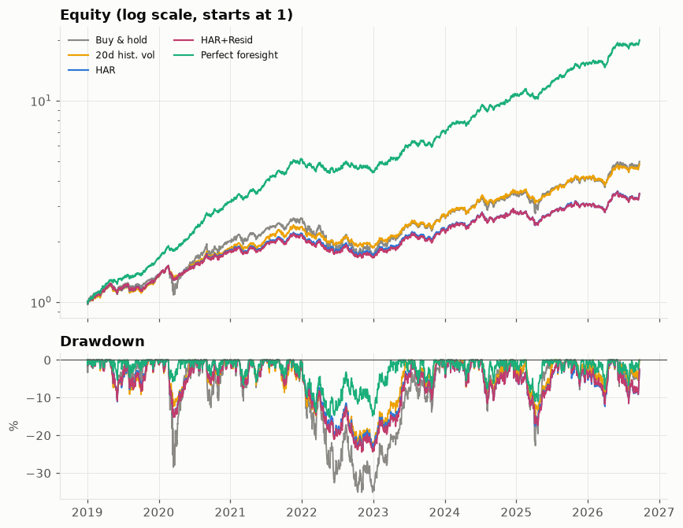
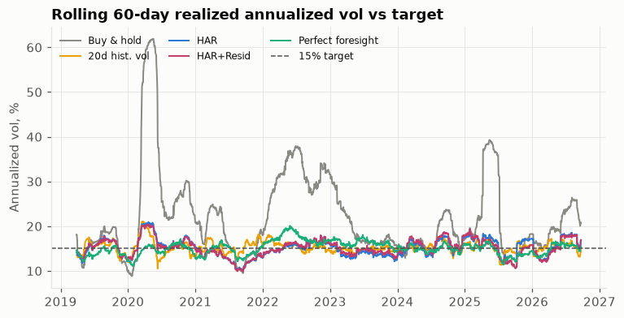

# Week 5 波動預測接部位管理

模型不變（見 `week04_xgb.md`、`week04_review_notes.md`）；本週只把預測轉成部位、回測、評估。
程式：`src/strategies.py`（部位規則）、`src/backtest.py`（執行、成本、評估、block bootstrap）。
只讀 `data/processed/predictions/`，不重新訓練任何模型。

## 結論

**波動預測的改進（Week 4 的 HAR+殘差XGB，日內 RV 的 QLIKE 比 HAR 低 7.5%）沒有讓部位管理
策略變好。**

* HAR+殘差XGB 對 HAR：夏普 1.1375 對
  1.1405，幾乎打平，block bootstrap p = 0.9173（不顯著）。
* **HAR+殘差XGB 對 20 日歷史波動（主要對手）：夏普 1.1375
  對 1.4715，差 -0.278，p = 0.001
  ——顯著更差**。全部 9 組 σ目標 × 槓桿上限（第六節）都是同一個方向：20 日歷史波動最好，
  HAR 與 HAR+殘差XGB 幾乎打平且始終不如 20 日歷史波動。
* 誤差較低（QLIKE 更好）沒有轉成策略更好，原因見第三節「兩層評估總表」與討論。
* 波動目標確實把最大回撤從買進持有的 -35.1% 壓到約
  -23.6%（HAR 系列）、-23.1%
  （20 日歷史波動）——風險管理本身有效，只是「用更準的波動預測」沒有讓風險管理本身更好。

完整解讀見 `week05_review_notes.md`。

## 一、部位規則與設定

* 波動目標部位：`w(t) = min(vol_target / σ̂(t), leverage_cap)`，預設 σ目標 = 15%、槓桿上限 = 1.5。
* 尺度校準：日內 RV 低估收盤到收盤風險（漏掉隔夜跳空），每折用**訓練段**估
  `E[rv_on]/E[rv]` 比例係數，套用到該折的測試段（`src/strategies.py::scale_ratios`）。
* 完美預知直接用實際 `rv_on`（已實現的收盤到收盤變異數代理），不需要校準。
* 20 日歷史波動不需要模型或校準：對收盤到收盤報酬取過去 20 日（含當天）已實現變異數，本身就在
  收盤到收盤尺度上。
* 主設定：t 日收盤算預測、收盤調整部位、賺 t 到 t+1 收盤報酬（`timing="close"`）；換手成本
  單邊 1 bp，無 no-trade 門檻。
* 比較樣本：HAR 與 HAR+殘差XGB 都有預測的共同日期，1939 天。

## 二、五個預測來源

`不調整`（買進持有 QQQ）、`20 日歷史波動`（主要對手）、`HAR`、`HAR+殘差XGB`（主模型）、
`完美預知`（用實際隔日 `rv_on`，理論上限）。

## 三、兩層評估總表：QLIKE（預測品質）vs 策略結果

**注意這裡的 QLIKE 跟 `week04_xgb.md` 的 QLIKE 不是同一個數字**：Week 4 比較的是「日內 RV
的 log 預測」對「當天的日內 RV」（HAR 0.1974、HAR+殘差XGB 0.1827）；
這裡比較的是「校準後的收盤到收盤變異數預測」對「實際收盤到收盤變異數（`rv_on`）」，是部位管理
真正在用的那個數字，也是唯一能把 20 日歷史波動、完美預知一起放進同一張表比較的方式。兩者原始
排序一致（HAR+殘差XGB 都比 HAR 好），但拿來跟 20 日歷史波動比就會出現下面這個反差。

| source | QLIKE | ann_return | ann_vol | sharpe | max_drawdown | calmar | avg_leverage | avg_turnover | tracking_error |
|---|---|---|---|---|---|---|---|---|---|
| Buy & hold | — | 0.2321 | 0.24 | 0.9671 | -0.3512 | 0.6609 | 1.0 | 0.0005 | 0.09 |
| 20d hist. vol | 0.3617 | 0.2273 | 0.1545 | 1.4715 | -0.2309 | 0.9843 | 0.8578 | 0.0304 | 0.0045 |
| HAR | 0.2743 | 0.175 | 0.1534 | 1.1405 | -0.2357 | 0.7424 | 0.8367 | 0.1028 | 0.0034 |
| HAR+Resid | 0.2652 | 0.1747 | 0.1536 | 1.1375 | -0.2447 | 0.714 | 0.8372 | 0.1118 | 0.0036 |
| Perfect foresight | 0.0000 | 0.4758 | 0.1531 | 3.1081 | -0.1514 | 3.1416 | 0.9393 | 0.2408 | 0.0031 |

**這就是「誤差較低但策略沒改善」的具體樣子**：HAR+殘差XGB 的 QLIKE 比 HAR 低（不論用哪個定義），
但兩者的夏普幾乎相同；20 日歷史波動的 QLIKE 明顯比兩個模型都差，夏普卻是全場最高。QLIKE 評的是
「變異數這個數字猜得準不準」，策略夏普評的是「部位隨時間怎麼變動、換手多少、跟報酬的時間對不對
得上」——兩者不是同一件事，預測更準不保證部位管理更好。

## 四、追蹤誤差

灰色虛線是 15% 目標。所有波動目標策略都貼著目標波動，買進持有（灰線）明顯偏離且波動的波動本身
也大很多。

## 五、逐年夏普與危機切片

逐年夏普：

| year | Buy & hold | 20d hist. vol | HAR | HAR+Resid | Perfect foresight |
|---|---|---|---|---|---|
| 2019 | 2.25 | 2.28 | 2.31 | 2.3 | 4.66 |
| 2020 | 1.34 | 2.54 | 2.12 | 2.05 | 6.28 |
| 2021 | 1.51 | 1.62 | 1.45 | 1.4 | 4.02 |
| 2022 | -1.01 | -1.27 | -1.31 | -1.33 | -0.68 |
| 2023 | 3.09 | 3.02 | 2.63 | 2.62 | 3.71 |
| 2024 | 1.42 | 1.75 | 1.12 | 1.19 | 3.23 |
| 2025 | 0.9 | 1.23 | 0.63 | 0.66 | 3.07 |
| 2026 | 1.54 | 1.57 | 1.28 | 1.29 | 3.09 |

covid_2020、tariff_2025 切片夏普：

| slice | Buy & hold | 20d hist. vol | HAR | HAR+Resid | Perfect foresight |
|---|---|---|---|---|---|
| covid_2020 | 0.09 | -0.28 | -0.32 | -0.4 | 3.12 |
| tariff_2025 | -0.91 | -2.29 | -2.02 | -2.29 | -1.06 |

同切片最大回撤：

| slice | Buy & hold | 20d hist. vol | HAR | HAR+Resid | Perfect foresight |
|---|---|---|---|---|---|
| covid_2020 | -0.234 | -0.078 | -0.1 | -0.1 | -0.032 |
| tariff_2025 | -0.224 | -0.142 | -0.145 | -0.143 | -0.106 |

兩個切片本身報酬都是負的（尤其 tariff_2025），所以切片夏普全面為負；波動目標策略的價值在切片
內的最大回撤明顯小於買進持有，不在切片夏普轉正。HAR 與 HAR+殘差XGB 在兩個切片內互有輸贏、差距
都很小，跟 Week 4 「HAR+殘差XGB 在 covid_2020、tariff_2025 的 QLIKE 都比 HAR 好」的結論方向
不一致——見 `week05_review_notes.md` 的討論。

## 六、夏普差異顯著性（block bootstrap，區塊 20 天，3000 次）

| A | B | sharpe(A)-sharpe(B) | p-value |
|---|---|---|---|
| HAR+Resid | HAR | -0.0026 | 0.9173 |
| HAR+Resid | 20d hist. vol | -0.2782 | 0.001 |
| HAR+Resid | Buy & hold | 0.1354 | 0.3343 |
| HAR+Resid+VRP | HAR+Resid | -0.0232 | 0.726 |

## 七、策略 N：波動預測 vs 加上溢酬微調

溢酬 = VXN 隱含年化變異數 − 模型年化變異數預測；低於訓練段門檻（25 分位數）時部位打
0.6 折。

| source | ann_return | ann_vol | sharpe | max_drawdown | avg_leverage | avg_turnover |
|---|---|---|---|---|---|---|
| HAR+Resid | 0.1747 | 0.1536 | 1.1375 | -0.2447 | 0.8372 | 0.1118 |
| HAR+Resid+VRP | 0.1581 | 0.1423 | 1.1104 | -0.2284 | 0.7858 | 0.1505 |

微調後的夏普、報酬都略低，最大回撤略淺、追蹤誤差轉負（波動比目標低一些）；對照第六節最後一列，
p = 0.726，沒有顯著幫助。

## 八、選做：HAR+殘差隨機森林

| source | QLIKE | ann_return | ann_vol | sharpe | max_drawdown | avg_turnover |
|---|---|---|---|---|---|---|
| HAR+Resid XGB | 0.1827 | 0.1747 | 0.1536 | 1.1375 | -0.2447 | 0.1118 |
| HAR+Resid RF | 0.2572 | 0.1733 | 0.1539 | 1.1262 | -0.2468 | 0.1129 |

隨機森林版對 HAR+殘差XGB 的夏普差異：sharpe(RF)−sharpe(XGB) = -0.0096，
block bootstrap p = 0.4393。

## 九、穩健性

執行時點／成本／門檻：

| variant | hist20 sharpe | har sharpe | har_resid_xgb sharpe | har_resid_xgb turnover |
|---|---|---|---|---|
| main (close, 1bp, no band) | 1.4715 | 1.1405 | 1.1375 | 0.1118 |
| cost = 3bp | 1.4592 | 1.101 | 1.0946 | 0.1118 |
| 5% no-trade band | 1.4865 | 1.1207 | 1.1332 | 0.1044 |
| timing = next-day open | 1.3735 | 1.1835 | 1.1317 | 0.1118 |

結論方向（20 日歷史波動最好、HAR 與 HAR+殘差XGB 打平且不如 20 日歷史波動）在每一種變化下都一樣。

σ目標 × 槓桿上限（9 組）：

| vol_target | leverage_cap | hist20 | har | har_resid_xgb | resid_beats_har | resid_beats_hist20 |
|---|---|---|---|---|---|---|
| 0.1 | 1.0 | 1.451 | 1.138 | 1.135 | False | False |
| 0.1 | 1.5 | 1.472 | 1.137 | 1.136 | False | False |
| 0.1 | 2.0 | 1.472 | 1.14 | 1.136 | False | False |
| 0.15 | 1.0 | 1.308 | 1.136 | 1.104 | False | False |
| 0.15 | 1.5 | 1.472 | 1.141 | 1.138 | False | False |
| 0.15 | 2.0 | 1.493 | 1.142 | 1.139 | False | False |
| 0.2 | 1.0 | 1.181 | 1.093 | 1.055 | False | False |
| 0.2 | 1.5 | 1.366 | 1.147 | 1.123 | False | False |
| 0.2 | 2.0 | 1.491 | 1.141 | 1.138 | False | False |

HAR+殘差XGB 在 9 組裡有 0/9 贏過 HAR、0/9 贏過 20 日歷史波動
——方向完全一致，不是特定參數組合下的巧合。
