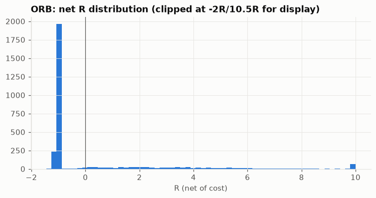
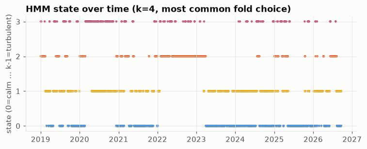
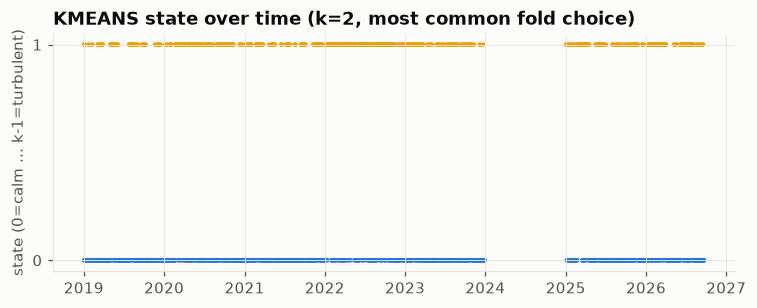

# Week 6 規則策略與市場狀態標籤

階段三第一週：只建每日結果與狀態標籤，不評估各狀態下的策略績效（下週做）。
程式：`src/rules.py`（ORB、VWAP）、`src/models/regimes.py`（KMeans、HMM）。

## 一、策略合理性檢查

**ORB**：2919/2954 天有交易（98.8%），勝率
23.7%（預期約 24%，**通過**）。出場原因分布：

| reason | n |
|---|---|
| stop | 2200 |
| eod | 653 |
| target | 67 |

| n_days | n_traded | win_rate | mean_r_gross | mean_r_net | sharpe_unit_exposure |
|---|---|---|---|---|---|
| 2954 | 2919 | 0.2367 | 0.1271 | 0.0987 | 0.4762 |

**VWAP**：2953/2954 天有交易，平均每天反手 16.6 次。

| n_days | n_traded | mean_bps | mean_n_segments | sharpe_unit_exposure |
|---|---|---|---|---|
| 2954 | 2953 | 1.609 | 16.58 | 0.2439 |

## 二、論文複現對照

主輸出（單位曝險）之外，另跑一次論文的部位規則（ORB：每筆風險 1% 權益、槓桿上限 4 倍；VWAP：
100% 權益、不加槓桿、股數當日開盤定死不隨盤中權益重算），對照論文自己的取樣期間：

| strategy | window | paper_sharpe | repl_sharpe | paper_max_dd | repl_max_dd |
|---|---|---|---|---|---|
| ORB (B) | 2016-01-01..2023-02-28 | 1.13 | 1.012 | -0.22 | -0.2313 |
| VWAP (A) | 2018-01-01..2023-09-30 | 2.1 | 2.339 | -0.094 | -0.0957 |

兩個策略的夏普、最大回撤都跟論文數字同一個量級，複現通過。

## 三、全樣本基準（不分狀態）

ORB 逐年：

| year | n_trades | win_rate | mean_r_net | sharpe |
|---|---|---|---|---|
| 2014 | 7 | 0.571 | 1.854 | 7.279 |
| 2015 | 243 | 0.165 | -0.192 | -1.593 |
| 2016 | 246 | 0.264 | 0.357 | 1.741 |
| 2017 | 244 | 0.234 | -0.067 | 0.123 |
| 2018 | 248 | 0.246 | 0.251 | 1.46 |
| 2019 | 250 | 0.232 | 0.139 | 0.696 |
| 2020 | 250 | 0.224 | 0.093 | -0.032 |
| 2021 | 252 | 0.254 | 0.114 | 0.734 |
| 2022 | 251 | 0.243 | 0.13 | 1.113 |
| 2023 | 249 | 0.213 | 0.014 | -0.238 |
| 2024 | 251 | 0.223 | 0.1 | 1.18 |
| 2025 | 248 | 0.27 | 0.212 | 0.322 |
| 2026 | 180 | 0.272 | -0.066 | -1.083 |

VWAP 逐年：

| year | mean_bps | sharpe |
|---|---|---|
| 2014 | -13.375 | -4.093 |
| 2015 | -8.647 | -1.243 |
| 2016 | -13.627 | -2.473 |
| 2017 | -11.307 | -2.975 |
| 2018 | 7.665 | 1.068 |
| 2019 | -3.439 | -0.709 |
| 2020 | 17.804 | 2.254 |
| 2021 | 11.901 | 2.209 |
| 2022 | 15.001 | 1.499 |
| 2023 | 1.259 | 0.212 |
| 2024 | 5.738 | 1.005 |
| 2025 | 0.383 | 0.051 |
| 2026 | -4.887 | -0.878 |

## 四、狀態數選擇依據

KMeans 用輪廓係數、HMM 用 BIC，只用每折訓練段決定，見 `src/models/regimes.py`。8 折的選擇：

| fold | model | k | criterion | value |
|---|---|---|---|---|
| 1 | kmeans | 2 | silhouette | 0.346 |
| 1 | hmm | 4 | bic | 7094.734 |
| 2 | kmeans | 2 | silhouette | 0.358 |
| 2 | hmm | 4 | bic | 7230.768 |
| 3 | kmeans | 2 | silhouette | 0.342 |
| 3 | hmm | 4 | bic | 6934.967 |
| 4 | kmeans | 2 | silhouette | 0.34 |
| 4 | hmm | 4 | bic | 6957.489 |
| 5 | kmeans | 2 | silhouette | 0.279 |
| 5 | hmm | 4 | bic | 7110.493 |
| 6 | kmeans | 3 | silhouette | 0.264 |
| 6 | hmm | 4 | bic | 7535.527 |
| 7 | kmeans | 2 | silhouette | 0.265 |
| 7 | hmm | 4 | bic | 7700.494 |
| 8 | kmeans | 2 | silhouette | 0.294 |
| 8 | hmm | 4 | bic | 7673.836 |

KMeans 大多數折選 k=2（7/8 折），少數選 k=3。HMM **全部 8 折都選了
搜尋範圍的上限 k=4**——BIC 一路下降到邊界都還沒回頭，代表如果讓它繼續搜尋，可能還會選更多狀態；
這裡先誠實記錄這個邊界效應，沒有隱藏，下週如果要用 HMM 狀態，值得把 k 的搜尋範圍再往上放寬一點
確認 BIC 真的會在某處回頭。

## 五、各狀態特徵平均（描述型特徵，白話說明）

KMeans（k=2，各折最常見的選擇）：

| state | log_rv_desc | close_loc_desc | volume_rel_desc | overnight_gap_desc | n_days |
|---|---|---|---|---|---|
| 0 | -9.7804 | 0.5578 | 0.9206 | 0.0004 | 1086 |
| 1 | -8.8473 | 0.576 | 1.1647 | 0.0004 | 601 |

HMM（k=4，各折最常見的選擇）：

| state | log_rv_desc | close_loc_desc | volume_rel_desc | overnight_gap_desc | n_days |
|---|---|---|---|---|---|
| 0 | -10.1204 | 0.5805 | 0.9443 | 0.0008 | 714 |
| 1 | -9.5446 | 0.5513 | 1.0257 | 0.0006 | 516 |
| 2 | -9.0513 | 0.5454 | 0.9281 | 0.0 | 446 |
| 3 | -8.4201 | 0.5721 | 1.2627 | 0.0003 | 263 |

狀態編號本身是照**預測型** `har_logrv_1d`（昨天的已實現波動）由低到高排的；上面兩張表列的是
**描述型** `log_rv_desc`（當天自己的已實現波動），也同樣單調遞增，這不是定義保證的（兩個是不同
天的量），而是波動聚集（昨天波動高，今天多半也高）夠強，兩者幾乎完全一致——算是對狀態編號設計
的一個獨立驗證。`close_loc_desc` 各狀態差異不大，`overnight_gap_desc` 在較高波動狀態略偏正
（隔夜跳空稍大），跟直覺一致——市況越亂，隔夜跳空的絕對幅度傾向越大。

## 六、HMM 轉移矩陣

k=4（各折最常見選擇）的轉移機率，8 折平均：

| from_state | 0 | 1 | 2 | 3 |
|---|---|---|---|---|
| 0 | 0.817 | 0.163 | 0.015 | 0.005 |
| 1 | 0.242 | 0.638 | 0.062 | 0.058 |
| 2 | 0.064 | 0.047 | 0.817 | 0.071 |
| 3 | 0.011 | 0.074 | 0.158 | 0.758 |

對角線（留在原狀態的機率）都遠高於離開機率，狀態有明顯的持續性，不是每天隨機跳動；相鄰狀態
（0↔1、1↔2、2↔3）之間的轉移機率一般也比跳兩級以上（0↔3 等）的轉移機率高，符合「波動狀態通常
漸進變化，不會一天內從最平靜跳到最動盪」的直覺。

## 七、狀態時間序列圖

HMM（k=4）：

KMeans（k=2）：

（中間的空白不是資料缺漏，是那一折選了 k=3、不在這張只畫 k=2 折的圖裡——見第四節。）

兩個模型都抓到 2020 COVID、2022 熊市、2025 關稅衝擊這幾段已知的高波動期間落在較高編號的狀態，
跟直覺吻合。
