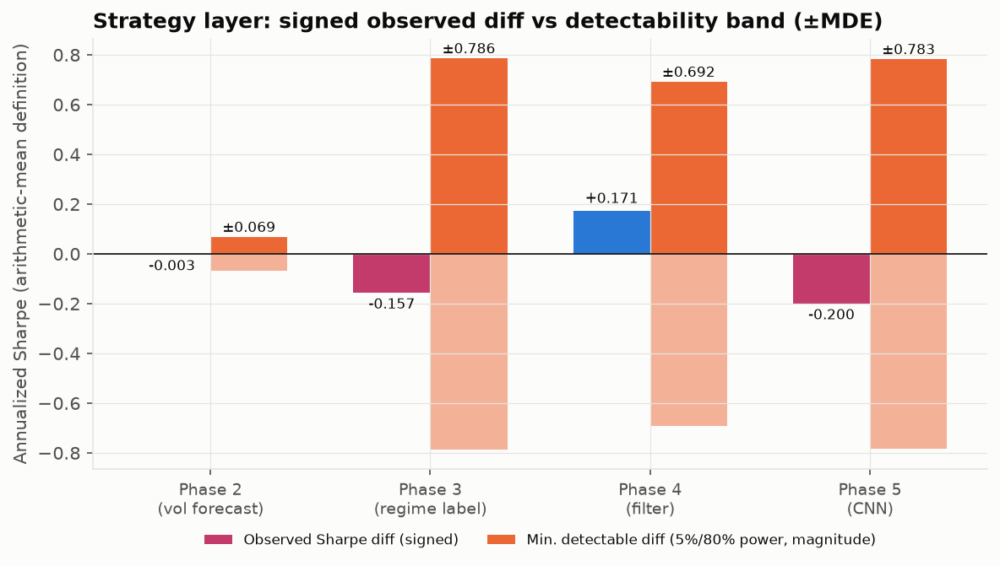

# Week 14 Part 2:「為什麼難」的量化

資料範圍:各階段自己的OOS walk-forward測試段(階段二2015-2026、階段三2020-2026共同範圍、階段四2018-2026、階段五2019-2026,見各階段章節)。策略層Sharpe一律用**算術平均年化定義**(mean/std×√252,跟block bootstrap/MDE同一定義,見results_summary.json的_cross_check_notes),不是各週報告顯示的複利版本。

## 一、預測層改善 vs 策略層觀察差 vs 最小可偵測差

**判讀分兩類,不是同一種「測不到」**:
- **階段二**:MDE只有0.069,遠小於其他三階段——不同波動預測模型接同一套vol_target部位規則後,產生的部位序列高度相關(配對比較的變異數小),檢定力本身
  夠高。觀察差0.003遠低於這個小的MDE門檻,這是**有檢定力支持的『沒有實質差異』**,
  不是測不到,是真的量不出差別。
- **階段三到五**:MDE落在0.7–0.8這個大得多的量級——樣本量(交易日數)沒有本質
  改變,但效果本身(篩選/狀態/CNN的貢獻)混在整體策略報酬的雜訊裡,檢定力不足。
  這三個階段是**偵測不到**,不是**偵測到沒有差異**——如果背後真有一個中等大小的
  效果,現有樣本量本來就看不出來,不能倒過來說『證明沒有效果』。

| 階段 | 預測層指標 | 預測層顯著性 | 策略層觀察差(算術Sharpe,保留正負號) | 策略層p值 | 最小可偵測差(MDE) | 達MDE? | 判讀 |
|---|---|---|---|---|---|---|---|
| phase2 | QLIKE差(HAR+殘差XGB−HAR) | DM p=0.00045(顯著改善) | -0.0026 | 0.9173 | 0.0686 | 否 | 有檢定力支持的沒有實質差異(MDE小,觀察差遠低於MDE) |
| phase3 | HMM state1/2 vs state0已實現波動差(t值) | t=9.93/12.20,p≈0(狀態標籤本身顯著,不是雜訊) | -0.1566 | 0.5700 | 0.7864 | 否 | 偵測不到(MDE大,檢定力不足;不代表沒有效果) |
| phase4 | AUC(logistic篩選ORB) | 中等,無對照基準模型可算DM/AUC差 | +0.1714 | 0.4845 | 0.6923 | 否 | 偵測不到(MDE大,檢定力不足;不代表沒有效果) |
| phase5 | AUC差(CNN−手工特徵logistic) | block bootstrap p=0.0008(顯著更差) | -0.1997 | 0.4700 | 0.7830 | 否 | 偵測不到(MDE大,檢定力不足;不代表沒有效果) |

**型態很一致**:四個階段裡,預測層(QLIKE/AUC/外部驗證t值)常常有統計上站得住腳的訊號或差異,但策略層的觀察差全部遠小於5%顯著/80%檢定力下的最小可偵測差(四階段都是「否」)——但如上表「判讀」欄所分:階段二是量過、量出來真的很小(有檢定力支持的沒有實質差異);階段三到五是根本量不到(檢定力不足),兩者結論不能混為一談。

**第10週的反推**(`reports/week10_robustness.md`第五節):要用現有的資料頻率偵測到0.2的夏普差,logistic模型需要約104年的OOS資料——這是全篇「為什麼難」最直接的量化:不是換模型或多等一兩年能解決的量級落差。

圖說:縱軸是策略層年化Sharpe,**算術平均定義**(mean/std×√252,跟block bootstrap/MDE同一定義,不是各週報告顯示的複利版本);橫軸四個階段用各自的OOS walk-forward測試段(階段二2015-2026、階段三2020-2026共同範圍、階段四2018-2026、階段五2019-2026)。圖片內文字為英文(全專案圖表慣例,預設字型無中文字符),中文說明見本節文字與表格。
